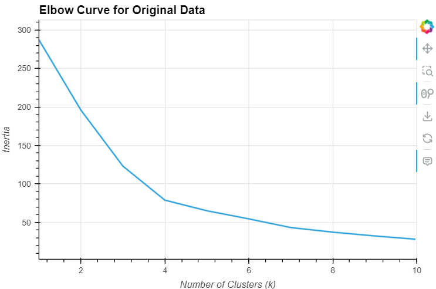
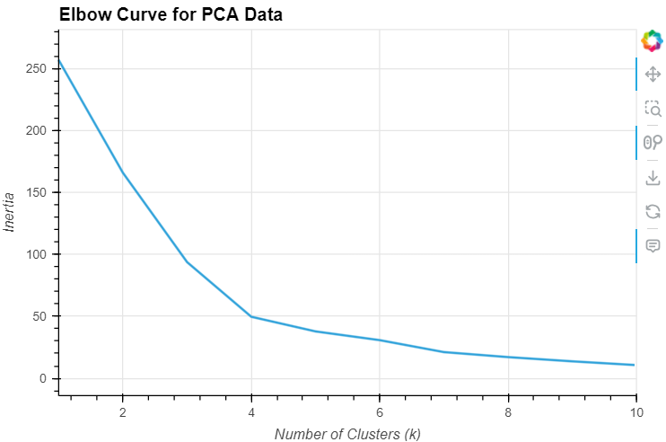
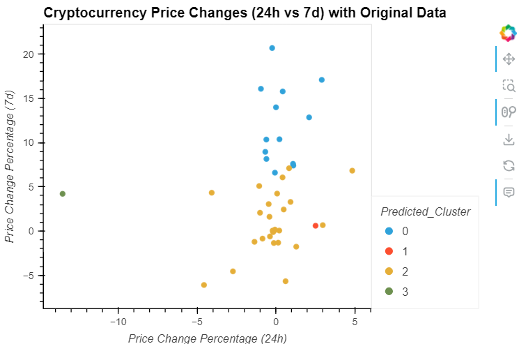
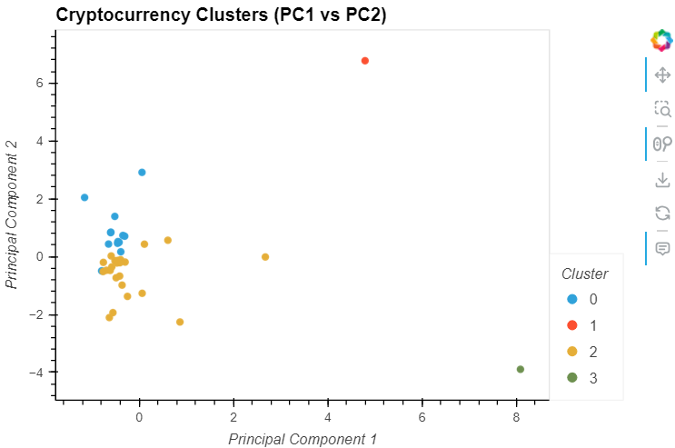

# Cryptocurrency Clustering Analysis

## Overview of the Analysis

### Purpose of the Analysis

This project involves clustering cryptocurrencies based on their price changes over various time intervals. The goal is to identify groups of cryptocurrencies with similar price behavior, which can aid in investment strategy and market analysis.

## Data
The data used in this analysis is a collection of various cryptocurrencies with their respective price change percentages over different time periods (24 hours, 7 days, 60 days, and 1 year).

## Methodology

1. **Data Normalization**: The data was normalized using `StandardScaler` to ensure that all features contribute equally to the clustering process.
2. **K-Means Clustering**: The K-Means algorithm was used to cluster the cryptocurrencies. The optimal number of clusters was determined using the Elbow method.
3. **Principal Component Analysis (PCA)**: PCA was applied to reduce the dimensionality of the data, making it easier to visualize and interpret the clusters.

## Results

### Optimal Number of Clusters
Using the Elbow Method, we determined that the optimal number of clusters (k) is 4. This was consistent across both the original scaled data and the PCA-transformed data.

The optimal number of clusters was determined using the Elbow method. By plotting the inertia values for different numbers of clusters, we identified that the optimal number of clusters is around 4, where the inertia starts to decrease at a slower rate.

1. **Elbow Curve for Original Data:**
   

From the presented Elbow curve, we can observe that significant changes in inertia occur up to 
`𝑘 = 4`. Beyond this value, the improvements in inertia become less substantial. We can see by eye from the array data that the inertia value begins to slow down at around 79, which is confirmed by the graph with the elbow method. It shows that up to 4, there was a significant decrease in inertia, and from 4 to 8, we see a window for investigation. 4, 5, 6, and 7 can be selected. Next, we need to link this result with business. Because an additional cluster in some cases can uncover an interesting group of customers for analysis.   

2. **Elbow Curve for PCA Data:**
   

Based on the Elbow curve the optimal value for `𝑘` appears to be around 4. This is where the inertia begins to decrease at a slower rate, indicating that adding more clusters beyond this point yields diminishing returns.
The optimal value of `𝑘`is the same for both the original data and the PCA-transformed data, which is `k=4`. This indicates that the clustering results are consistent regardless of the dimensionality reduction applied by PCA.

### Clustering with Original Data
Using the K-Means algorithm with \( k = 4 \), we clustered the cryptocurrencies based on their price changes. The resulting clusters were visualized in a scatter plot, showing the relationship between 24-hour and 7-day price changes. We can see that one of the clusters provides interesting information. Most points are concentrated around the zero values on the X-axis, indicating that there have been no significant price changes in the last 24 hours. However, the points in the blue cluster show significant weekly fluctuations. Additionally, the one-day changes for this cluster are more uniformly distributed.

### Clustering with PCA Data
PCA was applied to reduce the dimensionality of the data to three principal components, which captured approximately 89.50% of the total variance. The K-Means algorithm was then used with \( k = 4 \) to cluster the PCA-reduced data. The clusters were visualized in the PCA-reduced space. After scaling and applying the Principal Component Analysis (PCA), two clusters are still distinguished, and two others, as in the case with the original data, are outliers. The difference is that the two main clusters have shifted from the zero mark towards negative values on the PC1 component. The principal components allowed highlighting the key differences between the cryptocurrencies, making the visual recognition of clusters easier. As a result, unique clusters, such as the red and green points, emerged, demonstrating the unique characteristics of the cryptocurrencies.

### Comparison of Results

Elbow graphs are similar to each other, which aligns well with the fact that PCA retains 90% of the information from our dataset.

In this case, the PCA method was applied to the original data, and clustering was performed afterward. This allowed us to identify two unique cryptocurrencies that stood out noticeably on the graph to the right. In this case, the graphs are plotted in the coordinates of the original data and the PCA coordinates. The goal is to better visualize the differences when clustering. We are looking at our data from a different perspective.

In this case, we see that applying the PCA method does not affect the clustering. In this approach, we build clusters in the original coordinates. Since the graphs match, we see that applying PCA does not impact the clustering.

The main conclusion in this task is that applying the PCA method does not affect the clustering using K-Means. However, it improves visualization, making the identified clusters more noticeable.

### Future Work
Identified areas for improvement and potential future research, such as testing other clustering algorithms.
Suggested ways to enhance the model's accuracy and applicability in different market conditions.
By following these stages, the clustering analysis provided a structured approach to understanding the cryptocurrency market, offering valuable insights into the behavior and characteristics of different cryptocurrencies.

